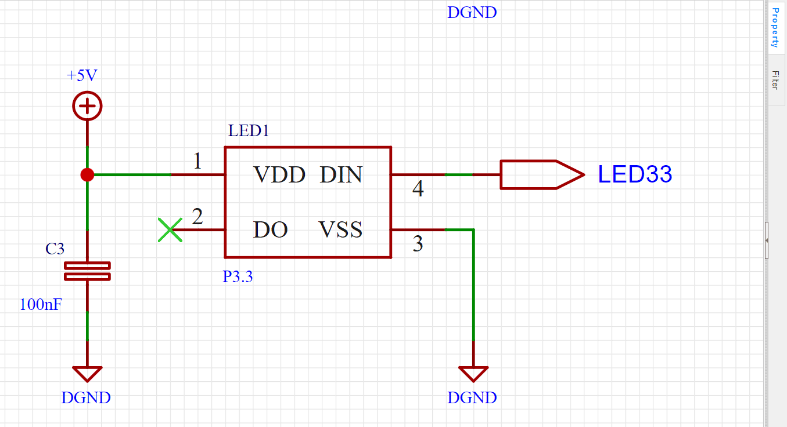
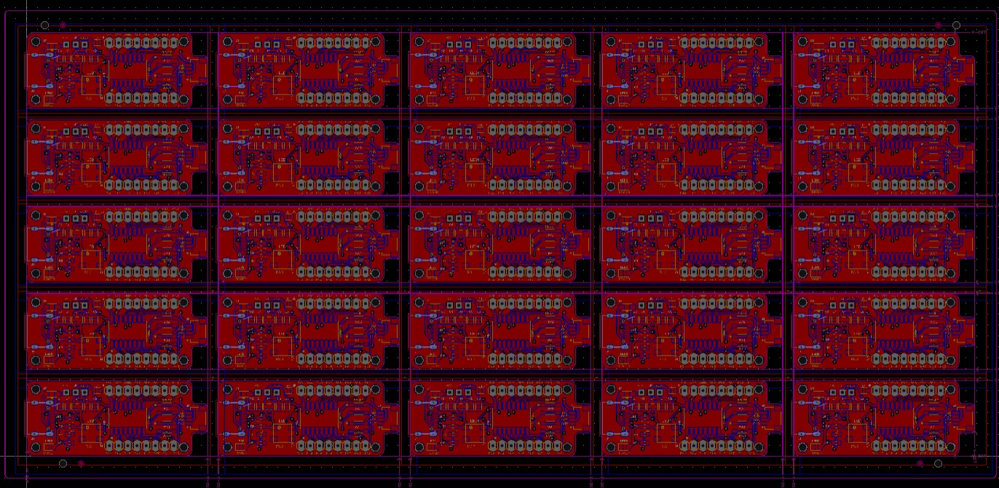

# Importación y exportación de archivos en EasyEDA Pro
Esta es una guía rápida para trabajar archivos PCB en EasyEDA que hayan sido creados en otros programas, en este apartado se toma como ejemplo la importación de un archivo creado en Fusion 360, así como modificaciones requeridas, panelización y exportación de archivos BOM, Gerber y posiciones.  

__*Nota:__ La versión de EasyEDA Pro utilizada para está guía es la __2.0.32__

## Contenido:
- [Importación y exportación de archivos en EasyEDA Pro](#importación-y-exportación-de-archivos-en-easyeda-pro)
  - [Contenido:](#contenido)
  - [Importación de proyectos Fusion 360](#importación-de-proyectos-fusion-360)
    - [Exportar proyecto desde Fusion 360](#exportar-proyecto-desde-fusion-360)
    - [Hacer la importación a EasyEDA](#hacer-la-importación-a-easyeda)
      - [Importar librerías](#importar-librerías)
      - [Importar proyectos](#importar-proyectos)
      - [NOTAS IMPORTANTES](#notas-importantes)
  - [Panelización](#panelización)
  - [Exportación de archivos EasyEDA](#exportación-de-archivos-easyeda)
    - [Bill of Materials (BOM)](#bill-of-materials-bom)
    - [Gerbers](#gerbers)
    - [Archivo de Centros](#archivo-de-centros)
  - [Referencias](#referencias)
   
## Importación de proyectos Fusion 360
Una vez que ya se tenga terminado el proyecto en Fusion 360, se debe exportar tomando en cuenta el formato de archivos que es capaz de soportar EasyEDA, ya que este software de diseño CAD no es capaz de admitir el mismo tipo de archivos con los que trabaja Fusion 360 (.f3z):

1. Abrir EasyEDA
2. Desde el menú de inicio se puede ver una gran variedad de iconos dentro de la sección de __Quick Start__, a simple vista se puede observar que se pueden importar archivos de EasyEDA, Altium y KiCad, sin embargo hay que dar click en __Import Other__
   
   

3. Dar click dentro de la sección __File Type__, se desplegará una serie de formatos compatibles para la importación

   

A pesar de que no es compatible la extensión .f3z utilizaremos archivos con el mismo formato que __Eagle__.

[Subir a Contenido](#contenido)

### Exportar proyecto desde Fusion 360

Tal cual no es posible exportar todo el archivo de proyecto en otro formato que no sea .f3z dentro de Fusion, sin embargo para esto se deberá exportar cada archivo del proyecto por separado, el primero será el __Esquemático__:

1. Abrir el archivo del diagrama esquemático y dar click en el icono de __Archivo__ en la esquina superior izquierda para acceder a la opción de __Exportar__

   

2. Dentro del menú exportar, aparecerán una serie de casillas:
   * Nombre: El nombre con el cual se exportará el archivo
   * Tipo: Aqui se selecciona el formato con el cual se generará el archivo, en este caso se guardará como "__Archivos compatibles con el esquema de EAGLE 9.X (*.sch)__". __*Nota: EasyEDA solo es capaz de abrir archivos de Eagle guardados en versiones superiores a la 6.0__
   * Ubicación: La ruta donde se guardará

   

3. Dar click en exportar

Una vez realizados estos 3 pasos hay que repetirlos con el archivo de la PCB, solo que en este caso se guardará con el tipo "__Archivos BRD de EAGLE 9.X (*.brd)__". En el caso de que el diseño contenga librerías personalizadas, se recomienda exportar las librerías, estas se deben de exportar como "__Archivos compatibles con la biblioteca de EAGLE 9.X (*.lbr)__"

[Subir a Contenido](#contenido)

### Hacer la importación a EasyEDA

Dentro del menú de importación visto anteriormente, se pueden agregar los proyectos y las librerías que se requieran.

#### Importar librerías

Antes de importar la librería es necesario crearla dentro de EasyEDA para importar todos los componentes. Para esto hay que seguir los siguientes pasos:

1. Desde el menú de inicio de EasyEDA, dar click en el icono de __New Library__ y le asignamos un nombre a nuestra librería.

   
   

2. Dentro del icono de __Import Other__ hay que seleccionar el tipo de archivo como __Eagle__, dar click en el campo de __Filename__ y seleccionar el archivo de la librería que vamos a importar, después de esto solo seleccionar la opción de __Import File and Extract Libraries__ como se muestra en la siguiente imágen:

   

3. Al darle click en Importar se desplegará una ventana donde podemos seleccionar los componentes de la librería que queremos importar y un campo donde se selecciona la librería de destino en donde se agregarán todos los componentes, aquí en este campo seleccionaremos la librería creada anteriormente.

   

Una vez importadas las librerías necesarias, podremos pasar a importar proyectos.

[Subir a Contenido](#contenido)

#### Importar proyectos

Debido a que no se pueden importar archivos de proyectos de Fusion 360, primero hay que crear un proyecto en EasyEDA donde se van a guardar los archivos exportados de Fusión

1. Desde el menú de inicio de EasyEDA, dar click en el icono de __New Project__ y le asignamos un nombre a nuestra librería.

2. Hay que regresar al menú de inicio y dentro del icono de __Import Other__ hay que seleccionar el tipo de archivo como __Eagle__, dar click en el campo de __Filename__ y seleccionar el archivo Esquemático que vamos a importar, después de esto solo seleccionar la opción de __Import File__ como se muestra en la siguiente imágen:

   

   Después de importarlo hay que volver a repetir el mismo paso para la importación de la PCB.
   
   __*Nota:__ Si al hacer la importación de la PCB el programa se congela o te marca un aviso de memoria insuficiente, asegurate de eliminar las imágenes o logos que tengas en tu PCB, ya que estos consumen  muchos recursos gráficos

3. Después de esto, nos desplegará nuestro diagrama esquemático o PCB dependiendo que hayamos importado, y en el menú de __Project Design__ que se encuentra del lado izquierdo de la pantalla también nos aparecerán nuestros archivos importados junto con los archivos generados por defecto.

   
   
4. Los archivos de esquemático y PCB generados por defecto están dentro de un archivo llamado "__Board__" esto le ayuda al software a vincular los diseños de esquemático y PCB entre sí. Sin embargo podemos observar que los archivos importados son independientes uno del otro, para vincularlos entre sí primero hay que borrar los archivos generados por defecto. Después de esto hay que darle click derecho al archivo de esquemático y seleccionar "__Set as New Board__", después de esto con la PCB damos click derecho y "__Set as an existing board__"

5. Para terminar de vincular ambos archivos hay que asociar cada símbolo esquemático con su footprint, para esto daremos click en cualquier componente y del lado derecho accederemos a las propiedades de este desde el menú __Property__, hay que dar click en la casilla de footprint y nos desplegará el __Footprint Manager__

   

6. Dentro del __Footprint Manager__ hay que seleccionar el componente y en la parte inferior buscar entre las librerías el footprint correspondiente al componente, hay que hacer esto para cada componente en el diseño y dar click en __Update__

   

   __*Nota: Asegurate de que el número de pines en el simbolo esquemático sea igual al número de pines en el footprint, de lo contrario EasyEDA marcara esta diferencia como un error__

7. Una vez realizado esto da click en el icono de "__Update/Convert Schematic to PCB__" u oprime "__Alt+I__", si todo sale bien, nos cambiará la ventana a la vista de la PCB

[Subir a Contenido](#contenido)

#### NOTAS IMPORTANTES

* Es posible que necesites modificar algunas librerías para hacer la vinculación entre la PCB y el esquemático, ya que EasyEDA no permite asignar más de un pad del footprint a un pin del esquemático

* Si un elemento solo existe en el diagrama esquemático y no posee footprint como los textos, frames o imágenes, deberás marcar que no se transfiera a la PCB desde el menú de propiedades del componente

* Con las etiquetas de redes importadas de Fusion 360 puede ser posible que EasyEDA las marque como componente y necesiten un footprint, en caso de que suceda esto, hay que reemplazarlas manualmente en EasyEDA con las etiquetas que maneja el software.

* Al hacer la importación de la PCB es posible que los planos de tierra hayan cambiado, asegurarse de volver a generar los planos de tierra con las características deseadas

[Subir a Contenido](#contenido)

## Panelización

EasyEDA posee una herramienta para poder hacer la panelización de manera rápida y sencilla.

1. Desde la barra de herramientas dar clic en __Tools>Panelize__ y el programa nos abrirá la herramienta de panelización

   

   La herramienta se divide en 4 secciones:

   * Type: Marca el tipo de división que se hará para separar las tarjetas
      * V-Cut: Líneas delgadas en las divisiones que permiten separar fácilmente la PCB
      * Stamp Hole: Se separa por pequeñas secciones de la tarjeta, las cuales contienen pequeños agujeros que permiten separarlas fácilmente
      * V-Cut + Stamp Hole: Un híbrido entre ambas, permite seleccionar en que dirección poner las líneas del V-Cut (Horizontal y Vertical) y las secciones del Stamp Hole las pondrá del lado contrario
   * Quantity: Cantidad de PCBs en el panel, así como su separación entre ellas y caracteristicas del V-CUT y Stamp Holes
   * Tecnology Side: Creación de fiduciales y marcas de posicionamiento para la fabricación del panel
   * Other: Marca los elementos que se van a panelizar, si solo se va a panelizar el borde de la tarjeta o todos los elementos en la PCB. También permite cambiar el punto de origen.

2. Seleccionar el tipo de panelización y parámetros de esta, se recomienda dejar separación entre las PCBs si existen componentes que puedan salir del borde de esta.
   
3. Dar click en Confirmar

Una vez generado el panel, si se requieren hacer modificaciones no es necesario modificar las PCBs una por una, solo hay que modificar la primera PCB del panel y automáticamente el cambio se verá reflejado en las demás.

   

En caso de que se requiera deshacer el panel y regresar a una sola PCB no se puede usar Ctrl+Z, porque si no va a deshacer el último cambio realizado a la PCB, para esto hay que entrar otra vez a la herramienta de panelización y seleccionar __No Panelize__

Easy EDA también permite hacer panelización manual, para esto solo hay que copiar los elementos de la PCB y pegar con el comando __Ctrl+Shift+V__, para hacer los bordes del panel y los V-Slots se pueden dibujar con la capa de __Border Layer__.
Para los Stamp holes, colocar diferentes circulos sobre el borde con un diámetro de __0.55mm__ y espaciado de __0.85mm__. Para las marcas de posicionamiento se recomienda poner circulos ranurados de __2mm__ de diámetro y para los fiduciales solo colocar pads de una capa de __1mm__ de diámetro.

[Subir a Contenido](#contenido)

## Exportación de archivos EasyEDA

### Bill of Materials (BOM)

Los archivos Bill of Materials o mejor conocidos como archivos BOM es una lista que incluye todos los componentes necesarios para fabricar la tarjeta y sus características más importantes como valor, designador, cantidad, etc.

1. Para generar este archivo, vamos a ir a la barra de herramientas acceder a __Export>Bill of Materials(BOM)__
   
2. Se abrirá una advertencia para saber si queremos revisar la estandarización de dispositivos, esto a pesar de que es un proceso opcional, nos permite asociar un número de parte de LCSC Electronics a cada componente, para así tener una referencia de las piezas al generar el BOM, en caso de dar click en __Check Device Standardisation__ nos habilitará del lado izquierdo de la pantalla una pestaña llamada __Device Standardization__, al acceder a está nos dará la opción de asignar el número de parte de LCSC.

3. Si al dar click en Export BOM accedemos a la opción de __Have been Check__ en la advertencia anterior, se abrirá el generador de archivos BOM, dentro de este podemos filtrar datos y seleccionar los campos que deseamos que incluya nuestro archivo, así como el nombre del archivo y el formato de este. Una vez terminado, dar click en __Export BOM__.

4. Se habrá generado un archivo separado por comas (.csv) o de hoja de cálculo (.xlsx) con los componentes de nustro diseño
   

__*Nota:__ En caso de haber hecho la panelización, el archivo BOM se generará para una sola tarjeta, no para todo el panel

[Subir a Contenido](#contenido)

### Gerbers

Los archivos Gerber son utilizados para la fabricación de las PCBs, para generarlos se hace de una manera muy similar al BOM:

   1. En la barra de herramientas acceder a __Export>PCB Fabrication File(Gerber)__

   2. Se abrirá un menú de exportación de archivos con dos opciones, __One Key Export__ para exportar de forma rápida los archivos Gerber, o __Custom Config__ donde se puede seleccionar las capas que van a ser exportadas, unidades de medición y más. Una vez configurado todo hay que dar click en __Export Gerber__

   

   3. Se generará un archivo .zip con todos los archivos Gerber, para corroborar que se generaron correctamente podemos visualizarlos con un software de CAM como FlatCAM u otros

__*Nota:__ Si se panelizó la PCB, los archivos Gerber se generarán con base en el panel, si se requieren los Gerber de una sola PCB hay que deshacer el panel

[Subir a Contenido](#contenido)

### Archivo de Centros

Este tipo de archivos se utilizan para la colocar componentes en la PCB con una Pick and Place, ya que contiene coordenadas con la ubicación de los componentes, capa y rotación

   1. En la barra de herramientas acceder a __Export>Pick and Place File__

   2. Se abrirá un menú de exportación de archivos muy similar al de los archivos BOM, dentro de este se pueden seleccionar los elementos que va a contener el archivo, unidades de medición, formato del archivo y otras tres opciones:
   
      * Mirror bottom components: Volteará los componentes en espejo de la capa Bottom en la coordenada seleccionada
      * Include panelized components' coordinates: Coordenadas para los componentes panelizados
      * Include panelized fiducial marks' coordinates: Incluye las coordenadas de los fiduciales del panel
   
   Una vez configurado todo hay que dar click en __Export__

   

   3. Se habrá generado un archivo separado por comas (.csv) o de hoja de cálculo (.xlsx) con las coordenadas de los centros de los footprint de cada componente

   

[Subir a Contenido](#contenido)

## Referencias

* [EasyEDA tutorial](https://prodocs.easyeda.com/en/faq/editor/index.html)

[Subir a Contenido](#contenido)

---

⌨️ con ❤️ por UNIT-Electronics 😊# Importacion-y-exportaci-n-de-archivos-en-EasyEDA-Pro
